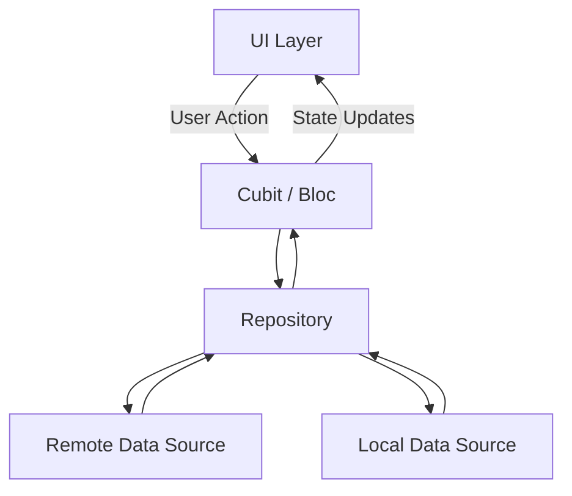

# 📚 Bookia Store

A production-style Flutter bookstore app focused on clean architecture, scalable feature modules, and polished authentication UX.

<p align="left">
  
  
  
  
</p>

## ✨ Highlights

- 🔐 Complete Auth Flow: Login, Register, Forgot Password, OTP, Reset Password.
- 🌍 Localization: English + Arabic using `easy_localization`.
- 📱 Responsive UI: Adaptive sizing with `flutter_screenutil`.
- 🧱 Scalable Structure: Feature-first organization with clean boundaries.
- 🧭 Maintainable Codebase: Reusable core widgets, centralized strings and themes.

---

## 🧰 Tech Stack

- **Flutter** + **Dart**
- **BLoC/Cubit** for state management
- **easy_localization** for i18n
- **flutter_screenutil** for responsive design
- **flutter_gen** for strongly-typed assets

---

## 🏗️ Architecture

The project follows a **Feature-First + Clean Architecture** approach where each feature can evolve independently.

```text
lib/
├── core/
│   ├── share_widgets/
│   ├── theme/
│   └── utils/
├── features/
│   └── auth/
│       └── Presentation/
│           ├── welcome_screen.dart
│           ├── login_screen.dart
│           ├── register_screen.dart
│           ├── forgot_password.dart
│           ├── otp_verification.dart
│           ├── create_new_password.dart
│           └── password_changed.dart
└── main.dart
```

### Data Flow



---

## 📸 Screenshots

### Authentication Flow

Experience the complete authentication journey with our polished UI:

#### 🎯 Authentication Steps (1 → 6)

<table align="center">
  <tr>
    <td align="center">
      
      <br/>
      <sub><b>Step 1 · Password Changed!</b></sub>
    </td>
    <td align="center">
      
      <br/>
      <sub><b>Step 2 · Create new password</b></sub>
    </td>
    <td align="center">
      
      <br/>
      <sub><b>Step 3 · OTP Verification </b></sub>
    </td>
  </tr>
</table>

#### 🔑 Recovery Flow

<table align="center">
  <tr>
    <td align="center">
      
      <br/>
      <sub><b>Step 4 · Forgot Password</b></sub>
    </td>
    <td align="center">
      
      <br/>
      <sub><b>Step 5 · Register</b></sub>
    </td>
    <td align="center">
      
      <br/>
      <sub><b>Step 6 ·welcome</b></sub>
    </td>
  </tr>
</table>

---

## 🚀 Getting Started

### Prerequisites

- Flutter SDK installed
- Dart SDK installed
- Android Studio or VS Code

### Run Locally

```bash
git clone https://github.com/your-username/bookia_store.git
cd bookia_store
flutter pub get
flutter run
```

### Optional: Regenerate Generated Files

```bash
flutter pub run build_runner build --delete-conflicting-outputs
```

---

## 🤝 Contributing

Contributions are welcome.

1. Fork the repository
2. Create your branch: `git checkout -b feature/your-feature`
3. Commit changes: `git commit -m "Add your feature"`
4. Push branch: `git push origin feature/your-feature`
5. Open a Pull Request

---

## 📝 License

This project is licensed under the MIT License. See [LICENSE](LICENSE).
