# 📚 Bookia Store

Bookia Store is a modern, feature-rich Flutter application designed for browsing and purchasing books. This project demonstrates a scalable and maintainable architecture, perfect for real-world production applications.

## 🚀 Features

- **Authentication System**:
  - 🔐 Login & Registration
  - 🔑 Forgot Password & OTP Verification
  - 🔄 Create New Password
- **Responsive Design**: precise UI scaling using `flutter_screenutil`.
- **State Management**: Robust state handling with **BLoC/Cubit**.
- **Clean Architecture**: Separation of concerns for maintainability.

---

## 🛠️ Tech Stack

- **Framework**: [Flutter](https://flutter.dev/) & [Dart](https://dart.dev/)
- **State Management**: [Bloc](https://pub.dev/packages/flutter_bloc) / Cubit
- **Architecture**: Feature-First / Clean Architecture
- **Responsive UI**: [flutter_screenutil](https://pub.dev/packages/flutter_screenutil)
- **Code Generation**: [flutter_gen](https://pub.dev/packages/flutter_gen) for assets management.
- **Dependency Injection**: _Starting to integrate GetIt (Planned)_

---

## 🏗️ Project Architecture & Structure

This project follows a **Feature-First** approach combined with **Clean Architecture principles**. Each feature is self-contained with its own data, domain (logic), and presentation layers.

### 📂 Folder Structure

```
lib/
├── core/                   # Core functionality shared across the app
│   ├── theme/              # App theme, colors, and styles
│   ├── utils/              # Utility classes, assets generation
│   └── ...
├── features/               # Feature-based modules
│   ├── auth/               # Authentication Feature
│   │   ├── data/           # Data layer (Repositories, Data Sources)
│   │   ├── cubit/          # State Management (Cubit/Bloc)
│   │   └── Presentation/   # UI Layer (Screens, Widgets)
│   │       ├── login_screen.dart
│   │       ├── register_screen.dart
│   │       └── ...
│   └── ...                 # Other features (Home, Cart, Profile)
└── main.dart               # App entry point
```

### 📐 Architecture Diagram

Below is a high-level overview of how data flows within a feature:

```mermaid
graph TD
    UI[🖥️ Layout & Widgets] -->|User Action| Cubit[⚡ Cubit / Bloc]
    Cubit -->|Request Data| Repo[📦 Repository]
    Repo -->|Fetch Data| Remote[🌐 Remote Data Source]
    Repo -->|Fetch Data| Local[💾 Local Data Source]
    Remote & Local -->|Return Data| Repo
    Repo -->|Return Data/Failure| Cubit
    Cubit -->|Emit State| UI
```



---

## 📸 Screenshots

| Login Screen | Register Screen | Home Screen |
|:---:|:---:|:---:|
|  |  |  |

*(Note: Add screenshots to `assets/screenshots/` folder to display them here.)*

---

## 🚀 Getting Started

Follow these steps to run the project locally.

### Prerequisites

- [Flutter SDK](https://docs.flutter.dev/get-started/install) installed.
- [Git](https://git-scm.com/) installed.

### Installation

1.  **Clone the repository**:
    ```bash
    git clone https://github.com/your-username/bookia_store.git
    cd bookia_store
    ```

2.  **Install dependencies**:
    ```bash
    flutter pub get
    ```

3.  **Generate code (if needed)**:
    ```bash
    flutter packages pub run build_runner build --delete-conflicting-outputs
    ```

4.  **Run the app**:
    ```bash
    flutter run
    ```

---

## 🤝 Contributing

Contributions are welcome! If you find a bug or want to add a feature:

1.  Fork the project.
2.  Create your feature branch (`git checkout -b feature/AmazingFeature`).
3.  Commit your changes (`git commit -m 'Add some AmazingFeature'`).
4.  Push to the branch (`git push origin feature/AmazingFeature`).
5.  Open a Pull Request.

---

## 📝 License

This project is licensed under the MIT License - see the [LICENSE](LICENSE) file for details.
